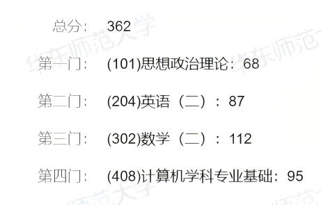

​	在三月底公布复试结果后爽玩了两个月，正好借着重新启动博客的时机回顾一下考研的经历，我是在三月中旬学校开学的时候开始准备的，整个备考经历是边学边玩，也有压力很大的时候🥲，好在最后还是上岸了，过程中并没有太多记录自己的进度，所以这篇文章更多的是分享自己的考研经历。

  

#### 背景与择校

​	我本科在上海大学的计算机科学与技术专业，高中没有选修政治加上大学红课都是开卷，政治可以算零基础；英语靠着上海高考吃了不少老本，四级裸考558分，六级前两次裸考493、485分，在考研前的一次六级520分；数学（高数和线代）大一因为要靠着绩点分流认真学了，有一点基础但是很多遗忘；408的四门专业课在本科都学过，大二学的数据结构和计组，大三学的OS和计网，前两门学的不太好，尤其是计组（学校里的期末考试偏背诵记忆）。

​	选择考研主要是在当时对于就业、留学、考公考编的其他选择
